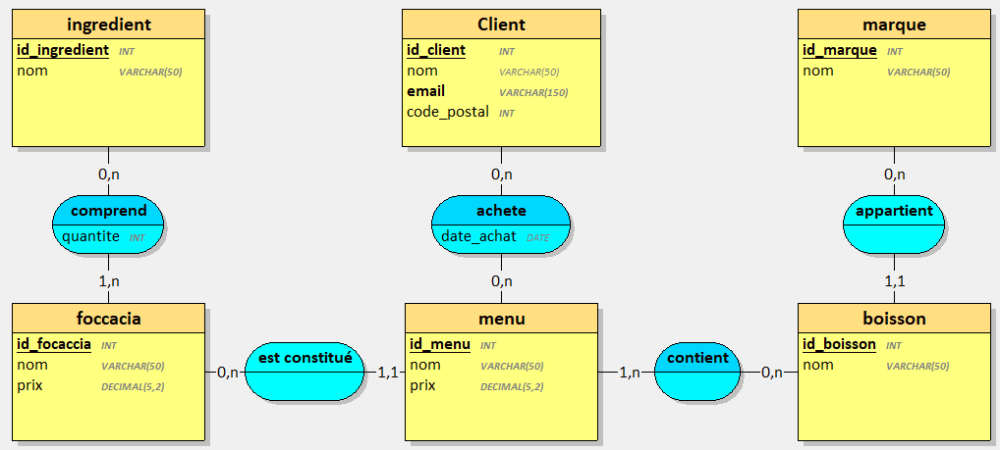

# Tifosi — base de données MySQL

Devoir appliqué : conception et mise en œuvre de la base de données du restaurant de street-food italien **Tifosi**.

Livrable demandé : ce dépôt GitHub public, contenant le schéma, les données de test et les requêtes de vérification.

## Contenu du dépôt

| Fichier | Rôle |
| --- | --- |
| `01_schema.sql` | Création de la base `tifosi`, de l'utilisateur MySQL et des tables |
| `02_insert.sql` | Insertion des données de test (fichiers Excel + jeux de démonstration) |
| `03_requetes.sql` | Les 10 requêtes de vérification, avec résultat attendu / obtenu |
| `docs/mcd-tifosi.png` | Modèle conceptuel fourni dans le brief |

## Du MCD au schéma physique

Le modèle conceptuel fourni par le restaurant :



Traduction retenue :

| Association MCD | Cardinalités | Implémentation |
| --- | --- | --- |
| `appartient` | marque (0,n) — boisson (1,1) | Clé étrangère `boisson.id_marque` |
| `est constitué` | focaccia (0,n) — menu (1,1) | Clé étrangère `menu.id_focaccia` |
| `comprend` | focaccia (1,n) — ingredient (0,n) | Table `comprend` + `quantite` |
| `contient` | menu (1,n) — boisson (0,n) | Table `contient` |
| `achete` | client (0,n) — menu (0,n) | Table `achete` + `date_achat` |

Contraintes d'intégrité mises en place :

- champs obligatoires (`NOT NULL`)
- unicité des noms et de l'e-mail client (`UNIQUE`)
- clés étrangères (`ON UPDATE CASCADE`, `ON DELETE RESTRICT` ou `CASCADE` selon le cas)
- `CHECK` sur les prix, les quantités et le code postal
- moteur InnoDB, encodage `utf8mb4`

Les tables `client`, `menu`, `contient` et `achete` n'apparaissent pas dans les fichiers Excel. Elles sont tout de même créées (MCD) et peuplées avec un jeu de démonstration, distinct des 10 requêtes officielles.

## Installation locale

1. Installer MySQL 8 (ou MariaDB) — par exemple via WAMP, XAMPP, MySQL Installer.
2. Ouvrir un client (mysql CLI, phpMyAdmin, HeidiSQL, Workbench).
3. Exécuter les scripts **dans cet ordre**, en tant qu'administrateur (`root`) :

```bash
mysql -u root -p < 01_schema.sql
mysql -u root -p < 02_insert.sql
mysql -u root -p tifosi < 03_requetes.sql
```

Compte applicatif créé par le schéma (droits limités à la base `tifosi`) :

- utilisateur : `tifosi`
- hôte : `localhost`
- mot de passe : `Tifosi2026!`

## Requêtes de test (synthèse)

Les résultats ci-dessous correspondent aux données des fichiers `focaccia.xlsx`, `ingredient.xlsx`, `boisson.xlsx` et `marque.xlsx`. Aucun écart n'a été constaté.

1. Focaccias par ordre alphabétique — 8 noms, de Américaine à Tradizione
2. Nombre d'ingrédients — **25**
3. Prix moyen des focaccias — **10,38 €**
4. Boissons + marques, triées par nom de boisson — 12 lignes
5. Ingrédients de la Raclaccia — 7 (Ail, Base Tomate, Champignon, Cresson, Parmesan, Poivre, Raclette)
6. Nombre d'ingrédients par focaccia — Paysanne 12, Mozaccia 10, …, Raclaccia / Emmentalaccia 7
7. Focaccia la plus garnie — **Paysanne** (12)
8. Focaccias à l'ail — Gorgonzollaccia, Mozaccia, Paysanne, Raclaccia
9. Ingrédients inutilisés — **Salami**, **Tomate cerise**
10. Focaccias sans champignon — **Américaine**, **Hawaienne**

Le détail (SQL, résultat attendu, résultat obtenu, écart) est dans `03_requetes.sql`.

## Publier le dépôt pour le rendu

Le correcteur doit pouvoir ouvrir le dépôt **sans invitation** :

1. Créer un dépôt **public** sur GitHub, par exemple `evaluation-bdd-mysql-tifosi`.
2. Dans ce dossier :

```bash
git init
git add 01_schema.sql 02_insert.sql 03_requetes.sql README.md .gitignore docs
git commit -m "Ajout du schéma MySQL Tifosi, des données et des requêtes de test"
git branch -M main
git remote add origin https://github.com/VOTRE-COMPTE/evaluation-bdd-mysql-tifosi.git
git push -u origin main
```

3. Vérifier dans **Settings → Danger Zone** que la visibilité est **public**.
4. Copier l'URL `https://github.com/VOTRE-COMPTE/evaluation-bdd-mysql-tifosi` dans CEF Learning.
